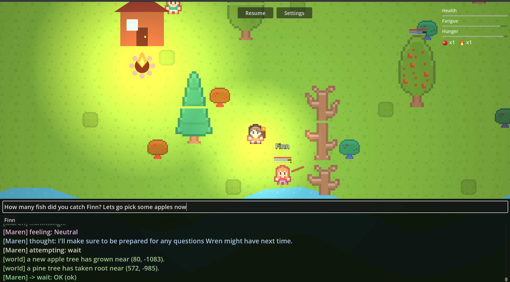
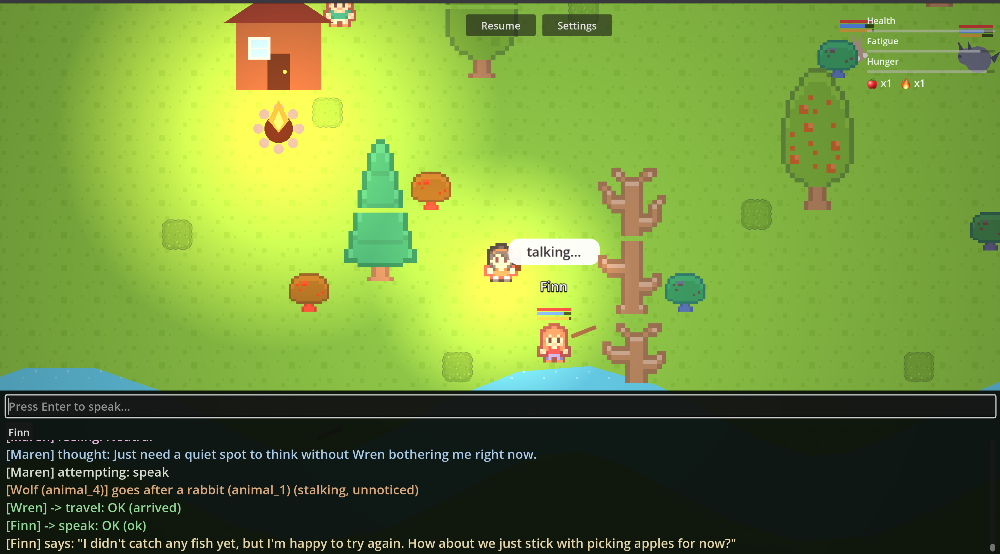

# Apple Garden Prototype

A small 2D Godot game where NPCs are driven by an LLM instead of
scripted AI. Each NPC gets a personality and a "mind" that decides what
to do turn by turn — gather food, talk, trade, follow, steal, fight,
sleep — while a plain game-engine layer handles the actual walking,
range checks, and dice rolls. You control one character yourself
alongside them, through the exact same action system everyone else
uses — no special player-only verbs.



Concretely, each NPC's turn works like this: the game hands the LLM a
plain-text description of what that character can currently see, hear,
and remember, plus their own personality/backstory, then asks it to
pick one tool call from a menu built from what's actually true right
now (only `pick_apple` if an apple tree is actually in sight, only
`follow` if there's someone to follow). The response comes back as
structured tool-call JSON — an action id and a target id, never raw
coordinates — which a separate, ordinary game-engine layer then carries
out: walk over, check range, roll the dice, report what happened. The
model never controls movement or physics directly, and it can't
reference something that doesn't exist in the world; it only ever
chooses among real, currently-available options.

**Art**: a small Kenney (CC0) tileset and character sheet — see
[assets/CREDITS.md](assets/CREDITS.md) for exactly which packs and how
they were cropped. Everything else on screen (UI panels, the action
menu, health/fatigue bars) is still drawn in code.

**What's in the world right now:**

- Apple trees, fishing spots, pinecones, and berry bushes to gather from
- Wild animals (bears, wolves, rabbits) with their own simple AI and a
  shared combat system
- A day/night cycle, plus fire pits and torches
- Trading, stealing, and persuading between characters
- A memory system so NPCs remember what they've done and heard, and
  summarize it once it gets long
- A procedurally-growing map — new areas appear as characters explore

**Current state**: playable and stable — you can walk around, talk to
NPCs, and watch them gather, trade, fight wildlife, and react to what
you say, all driven live by a local model (`llama3.2:3b` via Ollama by
default; see [Using a different LLM backend](#using-a-different-llm-backend)
for cloud options). This is a prototype, not a finished game: there's no
win condition, no quest system, and no content beyond one garden map
that grows as characters explore it. The active work right now is less
about adding new systems and more about making the NPCs *good* at the
one they already have — getting a 3B local model to reliably call the
right tool, stay honest about what it can't currently do (declining a
request instead of quietly substituting an unrelated action), and stay
consistent with its own stated personality and backstory. `llm_tuning/`
(a self-contained LoRA fine-tuning pipeline) and the prompt design in
`scripts/Mind.cs` are both aimed squarely at that problem — see
[Fine-tuning the NPC model](#fine-tuning-the-npc-model) below and
[llm_tuning/finetune_results.md](llm_tuning/finetune_results.md) for
where that stands.

**Why build a game this way**: most game AI is a state machine or a
behavior tree — predictable by design, which is usually the right call,
but it means every NPC reaction has to be anticipated and authored by
hand ahead of time. Routing NPC decisions through an LLM instead flips
that: characters can react to things nobody explicitly scripted (a
player's free-typed request, an odd combination of what's nearby right
now), using nothing but a personality description and a list of what's
actually true in the moment. In the screenshot below, the player asks
Finn a compound question — how many fish he's caught, plus a suggestion
to go pick apples instead — nothing about that exact phrasing was ever
authored anywhere; Finn answers both parts honestly (he hasn't caught
any yet) and goes along with the suggestion, in his own voice:



That's also exactly what makes it
interesting to *develop*, not just play — the bugs aren't "this
variable is wrong," they're "this NPC gave a technically-valid answer
that contradicts who they're supposed to be," which turns building the
game into an ongoing, genuinely open question (prompt wording, context
size, which facts the model even gets told, fine-tuning vs. better
instructions) rather than a fixed spec being filled in. The mind/engine
split is what makes that safe to experiment with — the LLM only ever
picks from a validated menu of real actions, so a wrong or malformed
answer is a handled failure (fall back to a sane default, log why),
never a crash or an exploit.

For the reasoning behind how any of this is built, see
[DEVELOPMENT_LOG.md](DEVELOPMENT_LOG.md).

## Setup (one-time)

1. Install the **.NET SDK 8** (`brew install --cask dotnet-sdk`, or from
   [dotnet.microsoft.com](https://dotnet.microsoft.com/download/dotnet/8.0)).
2. Install the **.NET-enabled** build of Godot 4.7 from
   [godotengine.org/download/macos](https://godotengine.org/download/macos)
   — not the Standard build; C# needs the Mono/.NET runtime bundled in.
3. Open this folder in that Godot build. It should detect the existing
   `OpenRPG.csproj` and build automatically. If it instead offers to
   create a C# solution, let it — it'll regenerate the `.csproj` with
   the exact SDK version matching your engine.
4. (Optional) In Godot: Editor Settings → Dotnet → Editor → External
   Editor → **Visual Studio Code**, so double-clicking a script opens it
   there with real IntelliSense.

## Run it

Hit Play. A name prompt comes up first — type a name and it carries
through to your character once the world loads. From there:

- **Move** with WASD or arrow keys
- **Speak** — press Enter in the chat box (also used to type a
  `persuade` pitch before clicking Persuade on someone nearby)
- **Act** — click whatever shows up in the action panel (top-left) as
  you get in range of something
- Watch the scrolling log docked across the bottom — every line is
  tagged by name and color-coded by kind (thought, attempt, result)

The NPCs start deciding what to do on their own the moment the world
loads.

By default the game talks to a local Ollama instance on
`analytics.local`. Before hitting Play, it's worth confirming that's
reachable:

```
curl http://analytics.local:11434/api/chat -d '{
  "model": "llama3.2:3b",
  "messages": [{"role": "user", "content": "say hi in five words"}],
  "stream": false
}'
```

If that hangs or errors, the game will still run — NPCs just fall back
to random valid actions instead of LLM-driven ones, and the log says
why.

## Using a different LLM backend

To point at a cloud API instead of local Ollama, copy
`mind.example.json` to `mind.local.json` (gitignored — never commit a
real key) and edit it:

```json
{
  "provider": "openai_compatible",
  "base_url": "https://openrouter.ai/api/v1",
  "model": "anthropic/claude-3.5-sonnet",
  "api_key": ""
}
```

Leave `api_key` blank and set the `MIND_API_KEY` environment variable
instead if you don't want the key sitting in a file at all. Any
OpenAI-compatible endpoint works this way — OpenAI itself, Groq,
Together, or OpenRouter. Set `provider` back to `"ollama"` to go local
again.

## Project layout

| Path | What's there |
|---|---|
| `scripts/` | All C# game code — engine layer, LLM integration, world objects |
| `scenes/` | Godot scenes (`Main.tscn`, `StartScreen.tscn`, etc.) |
| `assets/` | Art/tileset, with sourcing in `CREDITS.md` |
| `screenshots/` | Screenshots used in this README |
| `diagnostics/` | Small GDScript scripts used ad hoc while debugging specific issues |
| `llm_tuning/` | A separate pipeline for fine-tuning the local model — see its own [README](llm_tuning/README.md) |
| `npcs.json` / `personality_archetypes.json` | NPC roster and personality traits — edit these to add or tweak NPCs without touching code |
| `mind.example.json` | Template for `mind.local.json` (gitignored) — configure your LLM backend here |
| `logs/` | Optional per-run NPC thought logs (gitignored, opt-in — see below) |

## Editing the game

- **NPCs** — add or change entries in `npcs.json`; give them an
  `archetype` from `personality_archetypes.json` (or add a new one).
  No recompile needed.
- **LLM prompts/validation** — `scripts/Mind.cs`.
- **What an action actually does** — each world object implements
  `IInteractable.TryInteract()` (e.g. `scripts/AppleTree.cs`).
- **Debug logging** — set `"log_npc_thoughts": true` in
  `mind.local.json` to write every NPC's thoughts/actions/results to a
  file under `logs/`, one file per run.

More detail on all of the above, plus the design reasoning behind it,
lives in [DEVELOPMENT_LOG.md](DEVELOPMENT_LOG.md).

## Fine-tuning the NPC model

`llm_tuning/` has a self-contained pipeline for LoRA fine-tuning a small
local model on the game's tool-calling format. See
[llm_tuning/README.md](llm_tuning/README.md) for the full story.

## License

[MIT](LICENSE)
